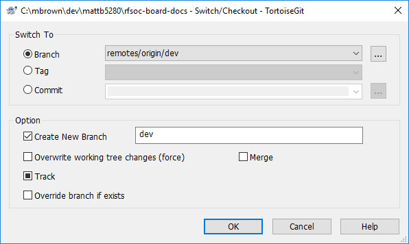

VS Code Installation for RST rendering
=======================================

Install the Software
---------------------

1. Install Pyton https://www.python.org/downloads/

.. image:: images/python_install.jpg

2. Add Python to your system path.

3. Install Visual Studio Code (editor only) https://code.visualstudio.com/

4. Open VS Code and install the **reStructuredText** extension

File Preview/rendering
----------------------

1. Create a new file and copy/paste the following text.

::

  **Bullet List**
    * one 
    * two 
    * three

2. Save with a **.rst** file extension.

VS Code Preview pane should display a formatted list like this:

.. image:: images/bullets_formatted.jpg

.. note:: If VS Code does not show a rendered preview, observe any warnings/errors. You may need to open a Windows CMD shell and enter commands as as instructed by the warnings in VS Code preview.

Common Issues
-------------

Sphinx ReadTheDocsTheme not installed
^^^^^^^^^^^^^^^^^^^^^^^^^^^^^^^^^^^^^^
The following error means that your conf.py file references a readthedocs theme that is not installed. Sphinx uses the theme to render your .rst as .html the way it will appear on readthedocs.org.
::

  Error
  Command failed: "C:\Users\Cecile\AppData\Local\Programs\Python\Python39\python.exe" -m sphinx -b html . "c:\Users\Cecile\Documents\Otava\Reference Design\DTRXX_TRX_Card\rfsoc-board-docs\docs\source\_build\html"
  WARNING: html_static_path entry '_static' does not exist

  Theme error:
  sphinx_rtd_theme is no longer a hard dependency since version 1.4.0. Please install it manually.(pip install sphinx_rtd_theme)

  Error: Command failed: "C:\Users\Cecile\AppData\Local\Programs\Python\Python39\python.exe" -m sphinx -b html . "c:\Users\Cecile\Documents\Otava\Reference Design\DTRXX_TRX_Card\rfsoc-board-docs\docs\source\_build\html"
  WARNING: html_static_path entry '_static' does not exist

**To resolve this:** open a Windows CMD shell and manually install the rtd theme for Sphinx using ``pip install sphinx_rtd_theme``

Preview Not Working
^^^^^^^^^^^^^^^^^^^^
If your preview is not working in Visual Studio, try the following.

1) Closing the .rst file, then close Visual Studio. 
2) From Windows Explorer, open your .rst file.
3) VS may prompt you for a **conf.py for Sphinx**. Choose the file associated with your project (VS usually suggests it for you).

.. image:: images/sphinx_conf.jpg

4) Click the Preview button in VS.

Git & GitHub
=============
Git is distributed revision control software. You will install GIT on your PC and use TortoiseGit as a convenient UI to interact with GIT.

Installs
--------
1. Install Git from https://git-scm.com/ 
2. Install TortoiseGit from https://tortoisegit.org/
   
   - If prompted, allow TortoiseGit to add context menus

We use a fork/pull method to allow authors to contribute to the main set of docs, maintained in our **AvnetDev/rfsoc-board-docs** upstream repository.

Upstream URL:  https://github.com/AvnetDev/rfsoc-board-docs

Terminology
-------------

Here is what you'll need to know about Git to start contributing. To learn more, go to https://git-scm.com/book/en/v2

* **upstream** - think of this as the main database, maintained by a few admins
* **fork** - your local copy of the upstream repository where you create docs and edit existing docs
* **pull request** - a signal to the admin of the upstream repository that you're ready for the changes made in your fork to be reviewed and merged into the upstream database
* **branch** - a unique version of the repository that diverges from the mainline. Branches allow you to work in your own 'sandbox', without affecting other authors who are also working the same repository. For rfsoc-board-docs, most authors will work in the /dev branch and issue pull requests to the /dev branch of the upstream repository. The admins will periodically merge the /dev branch into the /master branch for public releases.

Where Do We Publish? 
--------------------
We use the online service **readthedocs.io** to render our body of RST files into HTML that can be viewed on any web browser.

When the admin is ready to update the public view of the docs database, they will manually execute a build on readthedocs.io, which pulls files from our GitHub repository. You can configure the rendering tools to pull from any branch - we pull from the /master branch.

Setup GitHub
-------------
1. Register for an account @ https://github.com
2. Send your GitHub username to the Avnet admin and request to be a contributor
3. Once approved, go to the AvnetDev/rfsoc-board-docs page and fork the repository

4. Go to your personal GitHub page, click the 'Repositories' tab, then click on your newly created fork

5. On your GitHub fork page, click the green 'Code' button, then click the clipboard icon to copy the URL.

Clone Your Fork 
---------------
Next you will copy your GitHub fork to your local machine - a process known as "cloning"

1. Open Windows Explorer and go to a folder where you want to work ``c:\work``
#. In an open space, right-click and select **Git Clone ...**
#. Paste the URL of your forked repository into the URL field, and click OK.

4. You now have a "clone" of your GitHub forked repository where you can create and edit.
#. Switch to the /dev branch before making any changes. Right-click on the **rfsoc-board-docs** folder and select **TortoiseGit > Switch/Checkout...**
#. In the popup window, use the dropdown menu to select **remotes/origin/dev**, then click OK

Commit 
-------------------
When you've made changes that you want to commit (check in), do this.

1. Right-click on your top-level folder **rfsoc-board-docs** and select Git commit...
2. Add a few words in the commit notes field to explain what you've done.
3. Click commit

Push To Your Fork
------------------
When you're ready to contribute your changes to the upstream repo, you first need to push your local commits to your GitHub fork.

1. Right-click the top-level folder **rfsoc-board-docs** and select **TortoiseGit > Push...**
2. Make sure the popup window is configured like this, then click OK
   

Issue Pull Request
------------------
When you're ready for the changes made in your fork to be reviewed and merged into the upstream database, you will issue a "Pull Request" on GitHub.

1. Go to your GitHub fork
2. Go to the /dev branch and click **Pull Request**

3. Verify that you will be requesting a pull from your /dev branch into the upstream /dev branch

4. Add comments that may help the admin understand what you're committing, but remember that each commit will have already have a note from you, so keep this brief.

5. Click *Create Pull Request**

.. note:: Subsequent commits that you push to your fork in the /dev branch will be aggregated into this pull request until the admin accecpts and merges the PR into the upstream branch.

Pull Upstream
-------------
You will often want to syncronize your fork with the upstream repo in order to get changes from other authors. The mechanism for doing this is known as a "Pull". First we need to make TortoiseGit aware of the upstream repo.

1. Open **rfsoc-board-docs/.git/config** in a text editor
2. Add the following lines of code, then save the file

::

  [remote "upstream"]
	url = https://github.com/AvnetDev/rfsoc-board-docs.git
	fetch = +refs/heads/*:refs/remotes/upstream/*

3. Right-click the top-level folder **rfsoc-board-docs** and select **TortoiseGit > Pull ...**
4. In the popup window use the pulldown menu to select **upstream**, then click OK

You have just merged the latest changes from the upstream /dev branch into into your local repo. The next time you PUSH to your GitHub fork these changes will be reflected online.

.. note:: You may occassionally see a "merge conflict" during this step if you've been working on files that other authors have also been editing. You will need to resolve the conflicts manually by contacting the other author(s) to determine which changes should persist.
